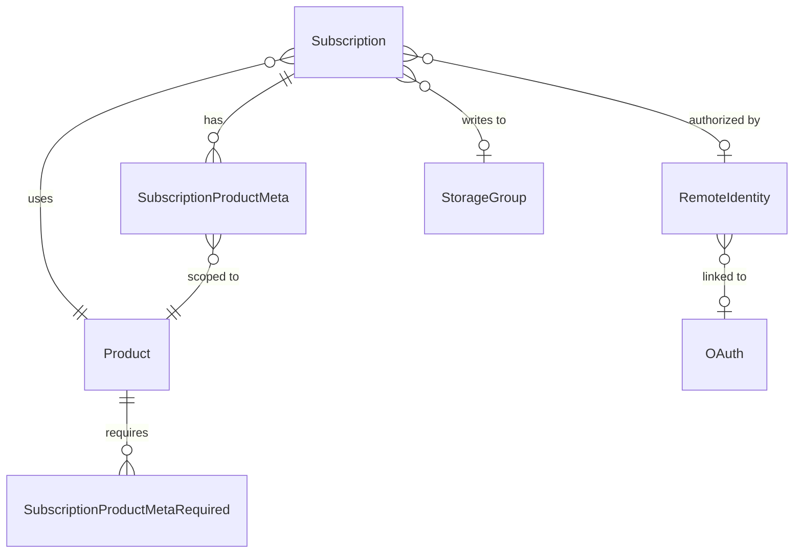

# Data Model

This document describes the core Openbridge data models and how they relate to each other. It is intended as conceptual grounding before working with the API references.

---

## The subscription pipeline

A **subscription** is the central object in Openbridge. It connects three things:

1. A **source product** — the data integration (e.g., Amazon Ads, Google Analytics)
2. A **remote identity** — the OAuth credential or service account that authorizes Openbridge to pull data from the source
3. A **storage destination** (`StorageGroup`) — where the collected data is written

When a subscription is active, Openbridge runs the pipeline on the configured schedule, pulling data from the source using the credential and writing it to the destination.

---

## Core entities

### Subscription

A `Subscription` record represents one configured pipeline.

**Fields:**

| Field | Type | Description |
|---|---|---|
| `id` | integer | Subscription ID |
| `account` | FK → Account | The account that owns this subscription |
| `user` | FK → User | The user who created the subscription |
| `product` | FK → Product | The source (or destination) product |
| `name` | string | Human-readable label, unique per storage destination |
| `canonical_name` | string | Normalized version of `name` |
| `status` | enum | `active`, `paused`, `cancelled`, or `invalid` — see below |
| `date_start` | datetime | Subscription start date (ISO 8601) |
| `date_end` | datetime | Subscription end date (ISO 8601) |
| `remote_identity` | FK → RemoteIdentity | Credential record authorizing data access. `NULL` for destination products and source products that do not connect to a third-party data source. |
| `storage_group` | FK → StorageGroup | Destination where data is written. `NULL` for destination subscriptions. |
| `invalidated_at` | datetime | Set when the subscription is cancelled. `NULL` while active. |
| `unique_hash` | string | Hash derived from the subscription's SPM values at creation time, used for deduplication when subscriptions are created through the Openbridge app. |

**Status lifecycle:**

| Status | Meaning |
|---|---|
| `active` | Pipeline is running normally |
| `paused` | Pipeline is temporarily suspended |
| `cancelled` | Pipeline has been stopped; `invalidated_at` is set |
| `invalid` | Subscription is in an error state (e.g., credential expired, misconfigured) |

To exclude invalid subscriptions when listing, filter with `status__not=invalid`.

See [Subscriptions API](./subscriptions-api.md) for endpoint reference.

---

### SubscriptionProductMeta (SPM)

`SubscriptionProductMeta` records carry product-specific configuration for a subscription. Each entry is a key/value pair attached to a subscription.

| Field | Type | Description |
|---|---|---|
| `id` | integer | SPM record ID |
| `subscription` | FK → Subscription | The parent subscription |
| `product` | FK → Product | The product this entry applies to |
| `data_key` | string | Attribute name (e.g., `stage_ids`, `remote_identity_id`, `profile_id`) |
| `data_value` | string | Attribute value, stored as a string regardless of format |
| `data_format` | enum | `STRING`, `JSON`, or `ENCRYPTED_STRING` |

**Common keys:**

- `stage_ids` — JSON array of pipeline stage IDs (e.g., `"[1000, 1001]"`). Required for source products. Obtain valid values from [Products API](./products-api.md) payload definitions.
- `remote_identity_id` — The remote identity ID as a string. Duplicates the top-level `remote_identity` field; required as an SPM entry for source products that connect to a third-party data source.
- Additional keys (e.g., `profile_id`, `project_id`, `advertiser_id`) are product-specific. The set of required keys for a product is defined by `SubscriptionProductMetaRequired` and surfaced in the `required_meta_fields` array on the product record.

SPM records are written inline during subscription creation via `subscription_product_meta_attributes` in the request body, and can be read independently via `GET /spm?subscription={id}`. See [Subscriptions API](./subscriptions-api.md).

---

### SubscriptionProductMetaRequired

`SubscriptionProductMetaRequired` defines which `data_key` values are required for a given product. This is the backing model for the `required_meta_fields` array returned by the Products API.

| Field | Type | Description |
|---|---|---|
| `product` | FK → Product | The product this requirement applies to |
| `key` | string | The `data_key` that must be present on subscriptions for this product |

When building a subscription creation request, check `required_meta_fields` on the product record to determine which SPM entries are mandatory.

---

## Supporting entities

### Product

A `Product` represents a data integration or a storage destination. The `is_storage_product` flag distinguishes the two types.

| Field | Description |
|---|---|
| `id` | Product ID — used as the `product` value in subscription and SPM requests |
| `name` | Display name |
| `is_storage_product` | `1` = destination (storage) product; `0` = source (data) product |
| `active` | Whether the product is currently available |
| `remote_identity_type` | The type of credential this product requires, or `null` if none |
| `required_meta_fields` | List of SPM `data_key` values required for this product |

See [Products API](./products-api.md).

---

### RemoteIdentity

A `RemoteIdentity` is a stored credential record — OAuth token set, service account key, or similar — that authorizes Openbridge to pull data from a third-party source on behalf of the account.

Remote identities are created and authorized through the Openbridge UI. They cannot be created via the API.

| Field | Description |
|---|---|
| `id` | Remote identity ID — used as `remote_identity` in subscription requests and `remote_identity_id` in SPM |
| `name` | Name associated with the identity (typically the account name or username at the third-party) |
| `remote_identity_type` | FK to the type of identity (e.g., Amazon Ads, Google) |
| `account` | The Openbridge account that owns this identity |
| `user` | The user who authorized this identity |

See [Remote Identity API](./remote-identity-api.md).

---

### OAuth

An `OAuth` record stores a custom OAuth client ID and secret for a specific `RemoteIdentityType`. Most products use Openbridge's built-in OAuth application, so an `OAuth` record is only needed for products that support user-supplied credentials. Currently those are **Snowflake** and **Shopify**.

When an `OAuth` record is used, it is linked to the `RemoteIdentity` created during the authorization flow via the `oauth` field on the `RemoteIdentity`.

| Field | Description |
|---|---|
| `id` | OAuth app record ID |
| `remote_identity_type` | The identity type this app applies to |
| `account` | The account that owns this record |
| `user` | The user that created this record |
| `name` | Label; auto-generated as `{remote_identity_type_id}:{client_id}` if not provided |
| `client_id` | OAuth client ID (encrypted at rest) |
| `client_secret` | OAuth client secret (write-only; encrypted at rest; never returned in responses) |
| `extra_params` | JSON string of provider-specific parameters (e.g., `account_authorization_url` for Snowflake, `shop_url` for Shopify) |

See [OAuth API](./oauth-api.md).

---

### StorageGroup

A `StorageGroup` is a configured storage destination. It links an Openbridge account to a specific cloud storage target (e.g., a Redshift schema, a BigQuery dataset, an S3 bucket).

Storage groups are created and managed through the Openbridge UI. They are read-only via the API.

| Field | Description |
|---|---|
| `id` | Storage group ID — used as `storage_group` in subscription requests |
| `name` | Human-readable label |
| `key_name` | Backend identifier for the storage target |
| `product` | The destination product this storage group is based on |
| `account` | The account that owns this storage group |
| `multi_storage_parent` | If this storage group is part of a multi-storage configuration, a reference to the parent `StorageGroup`. `NULL` otherwise. |

---

## Entity relationship summary

The following shows how identifiers flow when creating a source subscription:

| Value needed | Where it comes from |
|---|---|
| `account` | `GET /account` → `id` |
| `user` | `GET /user` → `id` |
| `product` | `GET /product` → `id` |
| `stage_ids` (SPM) | `GET /service/products/product/{id}/payloads` → `stage_id` |
| `remote_identity` | `GET /ri` → `id` |
| `remote_identity_id` (SPM) | Same value as `remote_identity`, passed as string |
| `storage_group` | `GET /storages` → `id` |
| Additional SPM keys | Product's `required_meta_fields` list |
