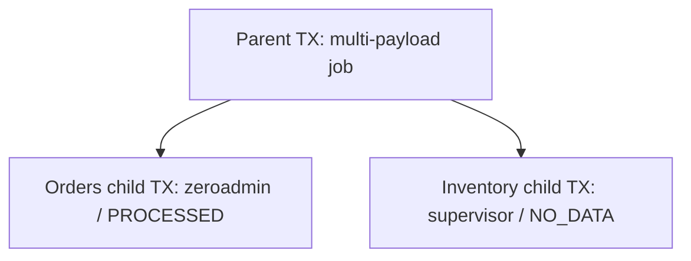

# Transactions API

## What a transaction represents

A transaction (TX) is a snapshot of job processing as work moves through the Openbridge pipeline. Use TXs to understand which component has handled work, what data date it concerns, and whether it loaded, found no data, encountered an error, or skipped a duplicate.

Updates to the same TX ID are merged into one record. **Retries use the same TX ID**, so a query shows the merged state rather than a history of every attempt or status transition. Records have **three-day database retention**. Save information you need beyond that window in your own system.

A [Job](./jobs-api.md) describes a pipeline execution run. A [HistoryTransaction](./history-api.md) requests historical retrieval. TXs describe processing snapshots and can carry a `job_id` for correlation; their IDs are separate from Job and HistoryTransaction IDs.

## Understanding processing state

Read `sender` and `status` together:

| Sender | Responsibility | How to interpret progress |
|---|---|---|
| `scheduler` | Retrieves jobs and initializes those scheduled to run | Work has reached scheduling/initialization |
| `supervisor` | Manages the worker that retrieves upstream data | Describes the retrieval part of the job |
| `ftpsync` | Formats retrieved data | Describes formatting and duplicate handling |
| `zeroadmin` | Loads data into the customer's destination | `PROCESSED` confirms data was loaded |

| Status | Meaning |
|---|---|
| `UNPROCESSED` | Work has not yet been processed by the reporting component |
| `PROCESSING`, `IN_PROGRESS` | Work is in progress at the reporting component |
| `RETRY` | The component reports a retry; retries reuse the TX ID |
| `ERROR` | The component reports a processing error; inspect `error_message` and `error_code` |
| `PROCESSED` | With `sender=zeroadmin`, confirms data was loaded into the destination |
| `SUCCESS` | Older, generally unused completion status; with zeroadmin, also confirms loading |
| `NO_DATA` | Typically reported only by supervisor: no upstream data was found when executing the job |
| `IGNORED` | Reported by ftpsync when it skips an exact hash duplicate |

Completion in an upstream component does not establish that the destination was loaded. Likewise, `NO_DATA` and `IGNORED` do not indicate a new load.

### How updates are merged

The writer gives later pipeline components precedence: `scheduler → supervisor → ftpsync → zeroadmin`. Once a component reports a completion status (`PROCESSED`, `SUCCESS`, `NO_DATA`, or `IGNORED`), another update from that same component does not replace the completed state. A higher-precedence component can still advance the TX.

The writer retains the latest reported time independently of that status selection. Consequently, `modified_at` and `timestamp` are not necessarily the time the displayed status was set. Non-completed updates from the same component follow arrival order rather than timestamp order.

Fields may be inherited or retained from earlier updates. Use the current `sender` and `status` to interpret error details; an `error_code` can remain from an earlier error even after the error message clears.

### Data date versus processing time

`attribution_date` is the **data date** requested upstream. For example, a job executing on February 1, 2026 can retrieve January 1, 2026 data. Its TX has `attribution_date: "2026-01-01"`, while its processing timestamps fall on February 1. Some products include a time component, such as `2026-09-09T19:00`; preserve the complete value when filtering.

The API exposes `modified_at` and the equivalent Unix-seconds `timestamp`. It does not expose a `created_at` field. Filtering by processing time and filtering by attribution date answer different questions.

## Parent and child transactions

A job can run multiple payloads. Scheduler or supervisor may create a parent TX that branches into one child per payload. This is a common reason for a transaction tree, though other processing cases can also create trees.



A completed child does not establish completion of every payload. Inspect each branch's sender and status.

A raw record's `parent` contains its parent TX ID, and `children` contains child TX IDs when present. Child records can inherit subscription, product, payload, attribution-date, and file-path values from their parent when those values are absent on the child. The writer does not automatically roll child statuses up into a parent status.

## Access through the Service API

The documented client operation is subscription listing:

> **Required on every GET list call:** Include `subscription_id` in the query string. This applies to raw results, `tree=true`, filtered queries, and every page requested with a cursor. Other parameters such as `job_id`, `parent`, or `cursor` do not replace it. Omitting `subscription_id` causes the Service API to return `403 Forbidden`.

```http
GET https://service.api.openbridge.io/service/transactions/tx?subscription_id=123456
Authorization: Bearer <jwt>
```

Use a token from the [Authentication API](./authentication-api.md). The Service API checks that the authenticated account owns the requested subscription and signs the backend request. `subscription_id` is required on every request, including subsequent pages.

### Query parameters

Filters are combined with AND. Equality filters match exact values; there are no substring filters, comma-separated multi-value filters, or configurable ordering. Supply each parameter only once.

| Parameter | Type | Behavior |
|---|---|---|
| `subscription_id` | integer | **Required on every GET list call**, including filtered queries, tree expansion, and subsequent pages |
| `limit` | integer | Default `50`; allowed range `1–200`; limits records evaluated before additional filters and tree expansion |
| `cursor` | string | Opaque pagination token from `meta.next_cursor` |
| `timestamp_from`, `timestamp_to` | integer | Inclusive lower/upper bounds on processing time, in Unix seconds |
| `modified_at_from`, `modified_at_to` | string | Inclusive lower/upper bounds on the stored timestamp text; compared lexicographically, so use its timestamp format consistently |
| `attribution_date` | string | Exact stored data date/time, such as `2026-01-01` or `2026-09-09T19:00`; a date-only value does not match a value containing a time |
| `job_id` | string | Exact associated job ID |
| `sender`, `status` | string | Exact component and status; use the case shown above |
| `parent` | string | Exact parent TX ID |
| `payload_name`, `product_name`, `subscription_name` | string | Exact stored name |
| `error_code`, `error_message` | string | Exact stored error code or full message |
| `file_path` | string | Exact stored file path |
| `time_to_live` | integer | Exact expiry timestamp in Unix seconds |
| `tree` | boolean text | `true` or `false`; default `false` |
| `tree_depth` | integer | Allowed only with `tree=true`; default `4`, range `1–4`; number of child levels to traverse |

Either range bound can be supplied on its own. When both are supplied, the lower bound must not exceed the upper bound. Prefer numeric `timestamp` bounds for processing-time queries.

### Response and field reference

The response always contains a `data` array, with each TX ID in `data[].id` and its fields in `data[].attributes`. There is no resource `type` field.

**Actual raw response excerpt (`tree=false`) — `200 OK`:**

```http
GET https://service.api.openbridge.io/service/transactions/tx?subscription_id=133650&tree=false
Authorization: Bearer <jwt>
```

The following excerpt retains two linked records from a larger response: a zeroadmin TX and its ftpsync parent. Other records are omitted for readability. The `next_cursor` is preserved from the original full page, so it advances past that entire page, including the omitted records.

```json
{
  "data": [
    {
      "attributes": {
        "attribution_date": "2026-09-09T19:00",
        "error_code": "",
        "error_message": "",
        "file_path": "/ebs/ftpd/946b0cf5f5156a15-133664/amazon-portfolios/amzn_budget_usage/03fab77afb1d6986c7283c857a1d8b25a8afaf84-03aa9_20260909190000.00000.gz",
        "job_id": "",
        "modified_at": "2026-09-09T18:56:52.776518",
        "parent": "5308573:03fab77afb1d6986c7283c857a1d8b25a8afaf84-budget_usage",
        "payload_name": "amzn_portfolios",
        "product_name": "amazon-portfolios",
        "sender": "zeroadmin",
        "status": "PROCESSED",
        "subscription_id": 133650,
        "subscription_name": "portfolios_test_subscription",
        "time_to_live": 1789239270,
        "timestamp": 1788980212
      },
      "id": "5308573:03fab77afb1d6986c7283c857a1d8b25a8afaf84-budget_usage-f2c7cd97865ddbd241e05906466ab15e"
    },
    {
      "attributes": {
        "attribution_date": "2026-09-09T19:00",
        "children": [
          "5308573:03fab77afb1d6986c7283c857a1d8b25a8afaf84-budget_usage-f2c7cd97865ddbd241e05906466ab15e"
        ],
        "error_code": "",
        "error_message": "",
        "file_path": "/ebs/ftpd/946b0cf5f5156a15-133664/amazon-portfolios/amzn_budget_usage/03fab77afb1d6986c7283c857a1d8b25a8afaf84-03aa9_20260909190000",
        "job_id": "",
        "modified_at": "2026-09-09T18:54:30.136208",
        "parent": "5308573:03fab77afb1d6986c7283c857a1d8b25a8afaf84",
        "payload_name": "amzn_portfolios",
        "product_name": "amazon-portfolios",
        "sender": "ftpsync",
        "status": "PROCESSED",
        "subscription_id": 133650,
        "subscription_name": "portfolios_test_subscription",
        "time_to_live": 1789239264,
        "timestamp": 1788980070
      },
      "id": "5308573:03fab77afb1d6986c7283c857a1d8b25a8afaf84-budget_usage"
    }
  ],
  "meta": {
    "next_cursor": "eyJTdWJzY3JpcHRpb25JZCI6IHsiTiI6ICIxMzM2NTAifSwgIlRpbWVzdGFtcCI6IHsiTiI6ICIxNzg4OTQ3Njc2In0sICJUcmFuc2FjdGlvbklkIjogeyJTIjogIjUzMDg1NzM6ZmJiNjI2ZTc3NDY3MGRiN2Q4MzkxYTQyMTMxMzFmYWRhNTU3ZjU5NSJ9fQ=="
  }
}
```

Read this example as follows:

- Records appear newest first, so the zeroadmin child precedes its ftpsync parent. With `tree=false`, `children` contains ID strings, not nested records.
- Both records report `PROCESSED`. The ftpsync record confirms formatting completion; the zeroadmin child confirms destination loading.
- Both records have empty `job_id` values. A raw `job_id` filter will not return them. Use `tree=true` on a matching ancestor with a populated job ID to expand its branches.
- `attribution_date` includes an hour (`2026-09-09T19:00`) in this response. It describes the requested data date/time, not when processing occurred. Exact attribution-date filters must use the full stored value.
- The ftpsync record lists the zeroadmin TX in `children` and points to an omitted ancestor in `parent`. Use these explicit links to follow the tree rather than parsing TX IDs.

These are recorded example values; use current processing-time bounds when querying the three-day retention window.

| Field | Type | Description |
|---|---|---|
| `id` | string | TX identifier; reused across retries |
| `attributes.subscription_id` | integer | Associated subscription |
| `attributes.subscription_name` | string | Subscription display name |
| `attributes.product_name` | string | Product name |
| `attributes.payload_name` | string | Payload/dataset name |
| `attributes.job_id` | string | Associated job ID; may be empty when not supplied |
| `attributes.attribution_date` | string | Requested upstream data date/time; may include a time component |
| `attributes.sender` | string | Reporting component selected by merge precedence |
| `attributes.status` | string | Processing state; interpret with the sender |
| `attributes.modified_at` | string | Latest reported processing timestamp, represented as UTC timestamp text, potentially with a trailing `Z` |
| `attributes.timestamp` | integer | Same processing timestamp in Unix seconds |
| `attributes.time_to_live` | integer | Database expiry timestamp, assigned at initial ingestion; normal updates do not extend it |
| `attributes.file_path` | string | File path associated with the work, when supplied |
| `attributes.parent` | string | Parent TX ID, or an empty string for a root |
| `attributes.children` | array | Child ID strings in raw mode; expanded child objects can remain in tree-mode results |
| `attributes.error_code` | string | Error code, when available; can retain a previous error's value |
| `attributes.error_message` | string | Error description; incoming messages are limited to 8,000 bytes |
| `meta.next_cursor` | string or null | Token for the next page; `null` means no further page in this query |

Fields can be empty or absent depending on the reporting component and available metadata.

### Pagination

Raw records are returned by descending `timestamp`. The limit applies to records evaluated before equality and `modified_at` filters, so a page can contain fewer than `limit` results—or an empty `data` array—and still have a `next_cursor`.

Continue until `meta.next_cursor` is `null`. URL-encode the returned cursor and keep the subscription, filters, and tree settings unchanged:

```http
GET https://service.api.openbridge.io/service/transactions/tx?subscription_id=123456&limit=50&cursor={{next_cursor}}
Authorization: Bearer <jwt>
```

In VS Code REST Client, set `next_cursor` to the encoded token from the previous response. TXs continue to change while work is running, so pagination should not be treated as a frozen snapshot.

## Query examples

Every example requires `subscription_id`; keep it in the query string when adding or changing filters. Replace the example subscription/job IDs and time bounds with your values. Time-bound examples use VS Code REST Client variables containing Unix seconds.

### Inspect recent processing

```http
GET https://service.api.openbridge.io/service/transactions/tx?subscription_id=123456&timestamp_from={{from_unix_seconds}}&timestamp_to={{to_unix_seconds}}
Authorization: Bearer <jwt>
```

### Follow one job

```http
GET https://service.api.openbridge.io/service/transactions/tx?subscription_id=123456&job_id=4100440
Authorization: Bearer <jwt>
```

### Inspect errors in the retained snapshots

```http
GET https://service.api.openbridge.io/service/transactions/tx?subscription_id=123456&status=ERROR
Authorization: Bearer <jwt>
```

This finds snapshots currently reporting `ERROR`, not every failed attempt. A subsequent retry can change the same TX's state.

### Find loaded work for a data date

```http
GET https://service.api.openbridge.io/service/transactions/tx?subscription_id=123456&attribution_date=2026-01-01&sender=zeroadmin&status=PROCESSED
Authorization: Bearer <jwt>
```

An old attribution date can appear in a recent TX, such as a backfill. Only retained TX records are searchable.

## Reading expanded trees

```http
GET https://service.api.openbridge.io/service/transactions/tx?subscription_id=123456&job_id=4100440&tree=true&tree_depth=4
Authorization: Bearer <jwt>
```

`tree=true` expands child references and returns **merged root-to-descendant records**, one per branch ending at a leaf or the requested depth. Non-empty descendant values override ancestor values; empty values, including numeric zero, do not overwrite inherited values. The returned `id` identifies the descendant reached, which can differ from the initially matched parent ID.

For a parent with an orders child reporting `zeroadmin / PROCESSED` and an inventory child reporting `supervisor / NO_DATA`, the expansion yields separate records for those outcomes. Shared fields can come from the parent. These merged records are views across the branch, so their fields need not all originate from one TX update.

Important consequences when consuming expanded results:

- Filters and the cursor apply to the initially queried records, before expansion. Descendants can have different field values from those used to match a parent.
- `limit` does not cap the number of expanded records. Expansion can produce more results than the requested limit.
- If the initial query includes both a parent and its descendants, expansion can return a descendant more than once. Do not count returned rows as distinct jobs or payloads without considering their TX IDs and relationships.
- Expanded `children` objects can remain in the output. Their IDs appear as `transaction_id` inside those objects, while top-level resource IDs use `id`.
- A missing referenced child can cause expansion to fail, including when related records expire at different times. Raw listing with `tree=false` can still help inspect available records.

To examine stored parent/child relationships without merged fields, use raw listing and optionally filter by `parent`:

```http
GET https://service.api.openbridge.io/service/transactions/tx?subscription_id=123456&parent=tx-job-example
Authorization: Bearer <jwt>
```

## Errors

| Status | Meaning |
|---|---|
| `200 OK` | Query completed; an empty `data` array is a valid result |
| `403 Forbidden` | Service API rejected access, including missing subscription ID or lack of ownership |
| `422 Unprocessable Entity` | Backend rejected query parameters, such as unsupported/repeated parameters, invalid integers, out-of-range limits/depth, or invalid ranges/cursors |
| `500 Internal Server Error` | Backend processing failed; tree expansion can fail when a referenced child is unavailable |

Authentication failures are handled by the Service API. Error body formatting can differ between service-level and backend failures; do not assume every error has the success response's `data` structure.
