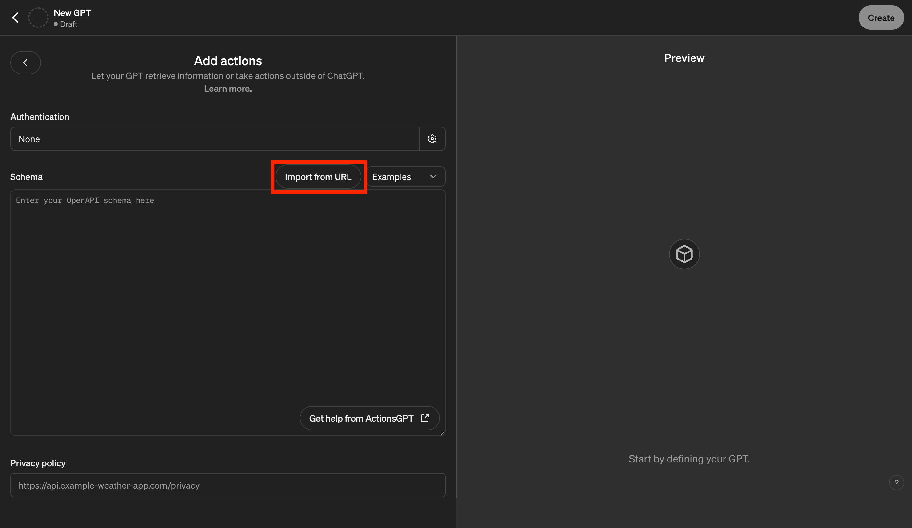

# Openbridge GPT (probably have tom write something here current 4 paragraphs are placeholder from 3rd party site make sure to change.)
At Openbridge, we are convinced that the true productivity of teams can only be unlocked through the flexibility of our product. Thus, we provide our API endpoints in expert mode to ensure maximum flexibility.

In contrast to Openbridge's GPT in standard mode, where you have limited control over the output, in expert mode, you customize your GPT configuration and utilize Openbridge's endpoints for specific actions. You are not just limited to utilize Openbridge for actions; you can also integrate other powerful actions too, such as Zapier.

This enpowers you to transform your GPT into a highly efficient chatbot that

Is equipped with comprehensive background knowledge and context, such as your sales, inventory, and out-of-home advertising data.
Operates based on your custom instructions.
Automates your daily tasks and routines through a variety of actions.
Is shareable among coworkers in your organization or publicly.

## Your Data Analyst GPT

### Step 1: Create a GPT
To create a custom GPT you will need to have a paid OpenAI account which will give you access to create a GPT.

Log into ChatGPT, and in the left menu choose "Explore GPTs".  Then in the right main window in the upper right corner click the "Create" button.

### Step 2: Configure Your GPT
In the left window of the page, click on `Configure`. 

 Give a name for your GPT and a brief description.

It is important to give your GPT instructions on how to use the actions.  Things they should do when accessing specific APIs and how to present the data.  We have provided some starter instructions for you, but it is recommended that you build upon them to better instruct your GPT on your specific use cases.  Copy and paste the contents of the file linked below into the instructions box of the GPT.

| GPT Type | Instruction Document URL|
|-|-|
| Data Analyst Instructions | [instructions-data-analyst.md](./instructions/instructions-data-analyst.md) | 

### Step 3: Authentication Token

Authentication to the Openbridge APIs for GPT is done through a long lived API token that is valid for 1 year.  You are allowed 1 long lived token at a time and therefore must be used on all GPT actions.

(add instructions for getting token here once we have UI for it.)

** Screen Shot goes here **

### Step 4: Creating Actions

At the bottom of the configuration page in the lower left you will find the "Create new action" button.  Click on this button to create our new action.  This will create a new action and open a new the Add Actions panel

Click on the gear  in the `Authentication` field and select `API Key`.  Then select `Bearer` as the `Auth Type`.  Paste the long lived token you retrieved above into the API Key field.  Do this for every action you created inside your GPT.

Click on the import button and add the following URL.  This will populate the Schema for the pipeline count API.

|API | Config URL |
|-|-|
| Service API | [api-service-data-analyst.yaml](./configurations/api-service-data-analyst.yaml) |

**Note to tom**:  The above should really be a URL they can copy and past and not a link, but we don't get the final URL until we merge into the main branch so it's a link for now

## Openbridge Account Extras.

Besides using your GPT to to help with your data analytics you can also use it as helper for your Openbridge Account.  To do this you will need to use a different import than above for the Service API, simply import the Service API config below.  Also, you will need to create actions for other Openbridge APIs. These actions are limited to GET functionalities.  All actions must use the same API key.

|API | Config URL|
|-|-|
| Pipeline Count API | [api-pipeline-count.yaml](./configurations/api-pipeline-count.yaml) |
| Remote Identity API | [api-remote-identity.yaml](./configurations/api-remote-identity.yaml) |
| Service API | [api-service-helper-account.yaml](./configurations/api-service-combined.yaml) |
| Subscription API | [api-subscriptions.yaml](./configurations/api-subscriptions.yaml) |

**Note to tom**:  The above should really be a URL they can copy and past and not a link, but we don't get the final URL until we merge into the main branch so it's a link for now

We also provide a starter instruction set for mixed GPT.

| GPT Type | Instruction Document URL|
|-|-|
| Mixed Instructions | [instructions-combined.md](./instructions/instructions-combined.md) |

## FAQ

### When I ask a question the GPT returns error.
The most common cause of this issue is GPT getting stuck or busy.  Often a refresh of your GPT page will solve the issue.

### Why doesn't the data returned match what I expect.
The first thing to check is that the GPT made an API call.  If no API call was made it could be working with it's own internal data.  We found that by adjusting the instruction set we could coax the GPT to making API calls.

### Why doesn't GPT make any API calls to Openbridge.
This can happen, ChatGPT often has data on various sources even though it's not Openbridge.  We found that by adjusting the instruction set we could coax the GPT to making API calls.

